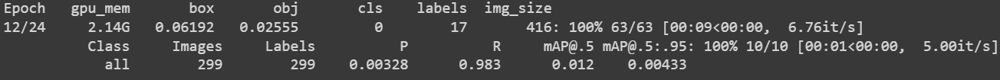
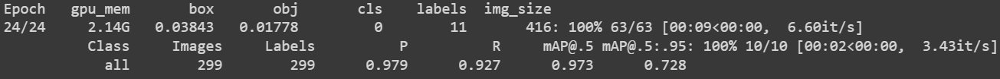
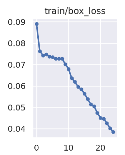
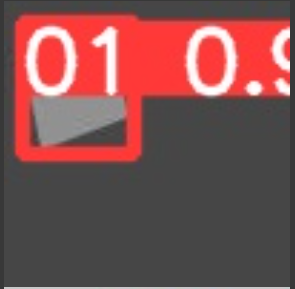
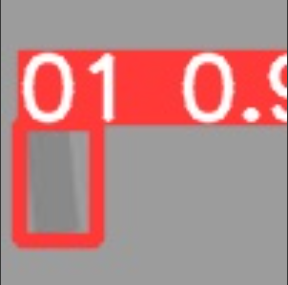
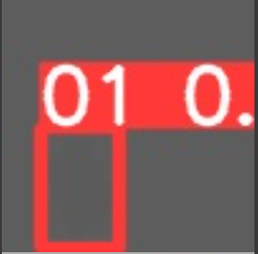
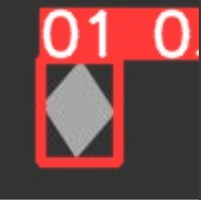
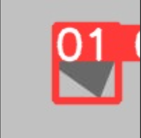

# 2. Поиск прямоугольника на изображении
Реализовать нейронную сеть (предпочтительно за основу взять сеть семейства YOLO), которая осуществляет поиск прямоугольников на изображении. В качестве обучающих и тестовых данных использовать ваш класс из п.1. Выходом обученной нейронной сети являются параметры описывающего прямоугольника. Привести график функции потерь (loss function) в ходе обучения. Привести максимальную, минимальную и среднюю оценку IoU для тестовой выборки из 1000 примеров для 2 разных checkpoint-ов обучения (промежуточного и финального).  

Реализована нейронная сеть на основе Yolo v5 из официального репозитория.  
Сгенерированы изображения и текстовые файлы с координатами описывающих прямоугольников.

```ruby
num_imgs = 1500
for i in range(num_imgs):
  image = object1()
  image.ran1()
  img = cv2.cvtColor(image.img, cv2.COLOR_BGR2GRAY)
  im = Image.fromarray(img)
  im.save(f"yolo/{i}.jpg")
  with open(f"yolo/{i}.txt", "w") as file:
      file.write(f'01 {image.describe[0]} {image.describe[1]} {image.describe[2]} {image.describe[3]}')
```  
С помощью сервиса Roboflow данные преобразованы в формат YoloV5 и загружены в модель.  
Обучение проходило на 25 эпохах с батчом в 16 изображений.  

## Результаты работы модели:  
Показатели метрик после 13 эпохи  
   

Показатели метрик после 25 эпохи  
   

График потерь в ходе обучения   
  

Примеры детекции прямоугольников  
  
  
  
  
  

